.. _features:

Features
========

Dataset browser
```````````````

.. figure:: ../_static/dataset_browser.png
   :scale: 50 %
   :alt: dataset browser screenshot
   :align: center

.. centered:: The dataset browser provides a simple detail view of each dataset properties and metadata.

Browseable API
``````````````

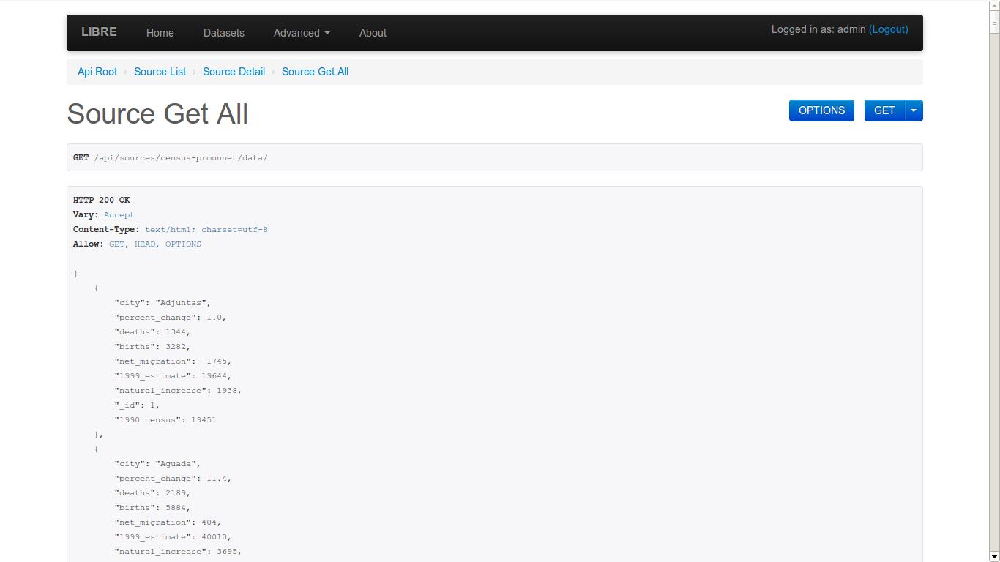

.. centered:: The browseable API renderer comes straight from Django REST framework but has been integrated in look and functionality. Allows for simple exploration of datasets without requiring any documentation.


Query builder
`````````````

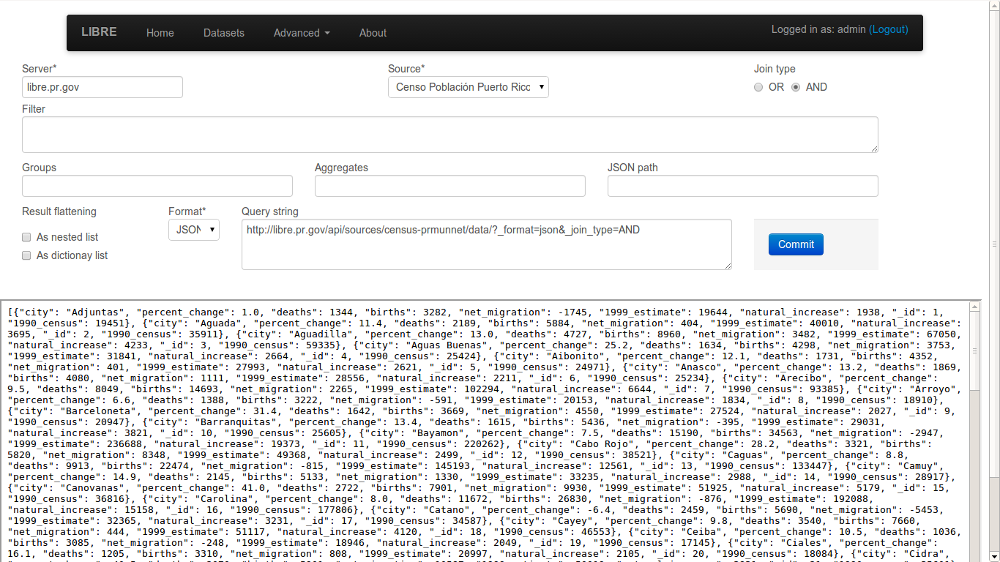

.. centered:: The query builder allows developers and users to create queries with an easy to use interface.


.. figure:: ../_static/filter_reduction_transformation.png
   :scale: 50 %
   :alt: query builder screenshot
   :align: center

.. centered:: Query builder also allows for quick test of queries, returning the final LQL query to repeat the same resultset outside the query builder.


Query engine
````````````

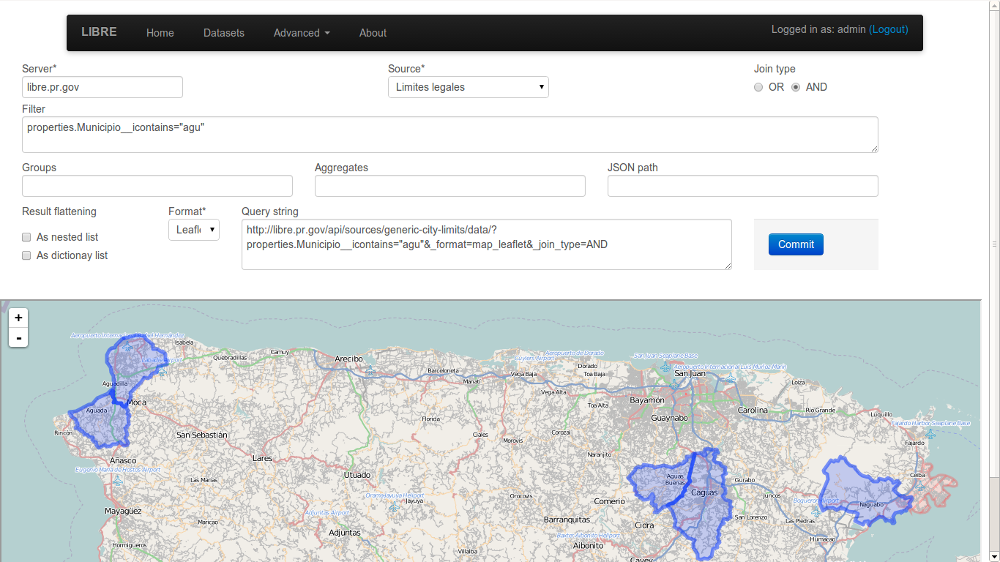

.. centered:: The LIBRE query engine support various types of source data, all of which are queried in the same manner. The engine also include various output renderers, such as this spatial render.


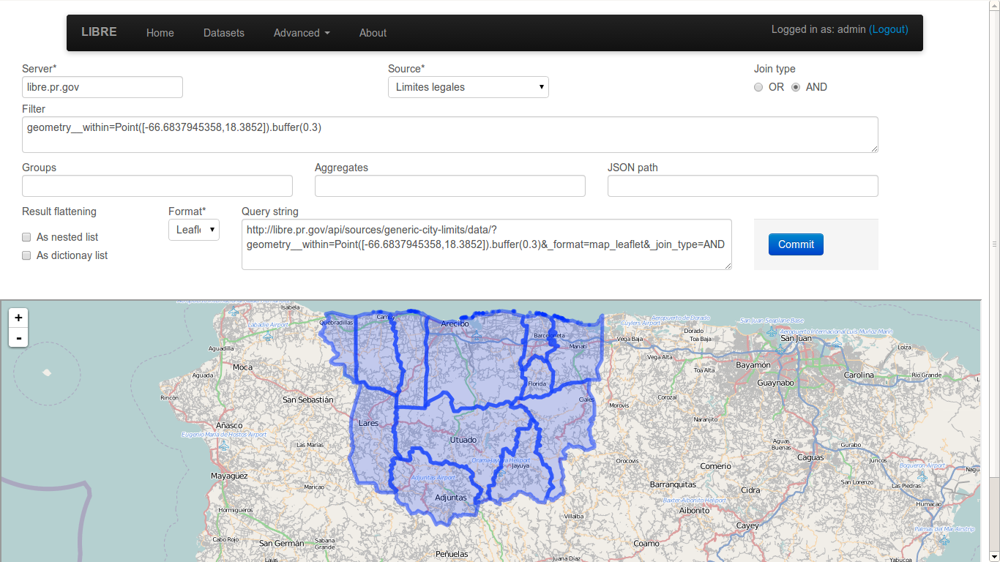

.. centered:: Spatial queries are also part of the LIBRE query language specification. Spatial queries are supported regarless the underlying database manager used for data storaged supports them or not, as they are implemented in the LIBRE query engine itself and not proxied to the database manager.


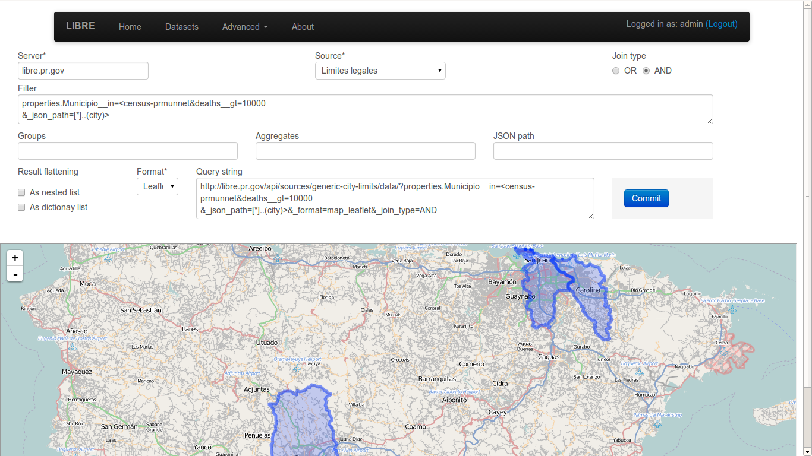

.. centered:: The LIBRE query engine also supports heterogeneous subqueries, where the results of a dataset can be filtered by the results of a query applied to a different dataset of a completely different data type. In this example shapefile features are being filtered based on the mortality rate that come from a fixed width column dataset.


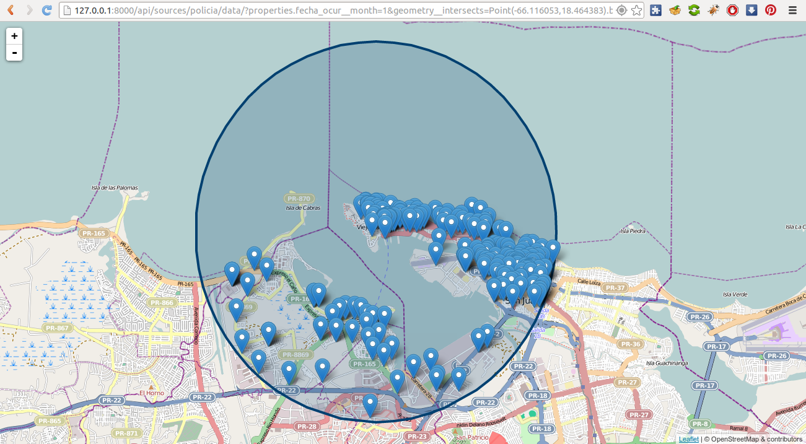

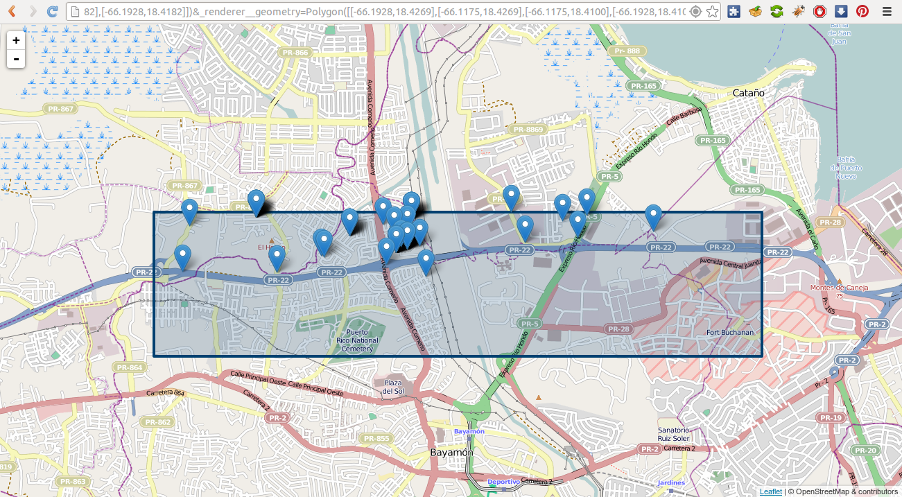


.. centered:: Because the LIBRE Query Language was created from the start to be a RESTful query language and not depend on a specific database manager client software, complex geometries can be specified straight from the browser URL and used for geo fencing the results.


Performance
```````````

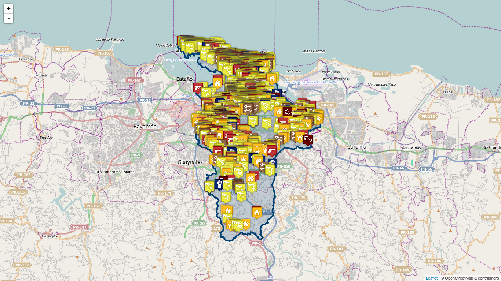

.. centered:: Even at the initial stages of development, the LIBRE query engine performance is very good, being able to do complex spatial filtering based on spatial subquering, rendering using geo fencing, custom markers and map geo fencing indicators in barely a few seconds. This example shows a crime map with city poliyon based geo fencing and custom crime markers with incident information popups. Many perfomance enhancements are already planned and can be found in the development section of the documentation.


Renderers
`````````

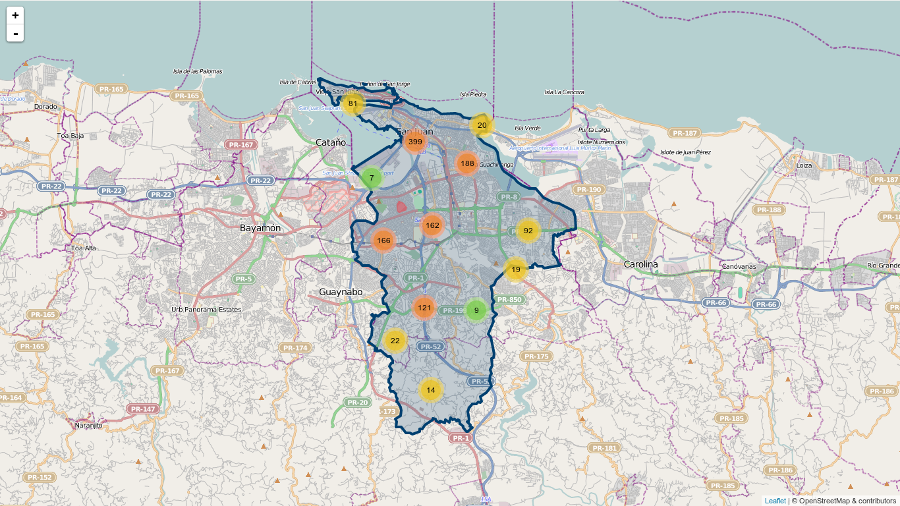

.. centered:: Aside from supporting multiple input data types, the LIBRE query engine also supports mutiple output renderers each itself with several plugins and specific options. This is the same crime map rendered with the marker cluster plugin enabled.


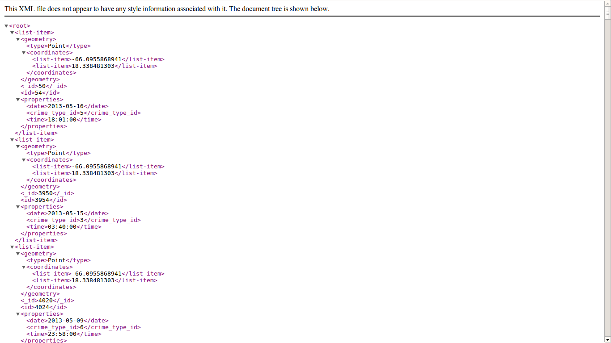

.. centered:: Exactly the same crime data in XML format.


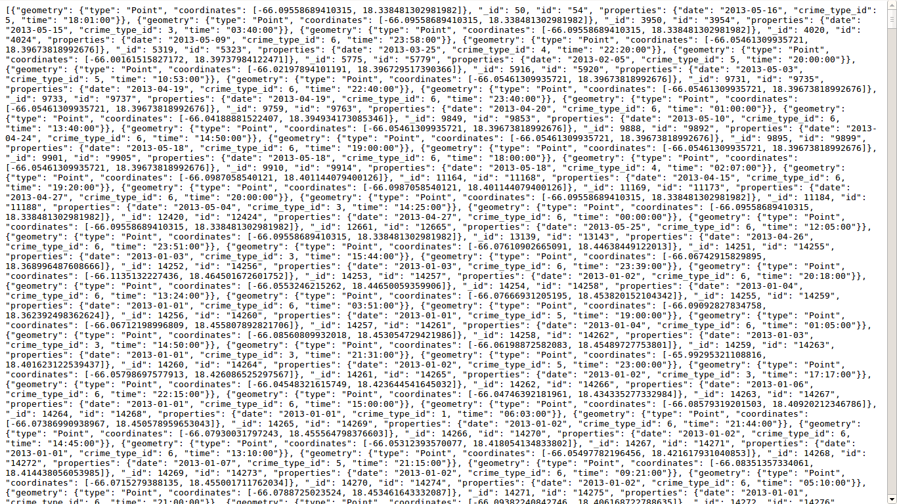

.. centered:: Again the same crime data in Geo JSON format.


Integration
```````````

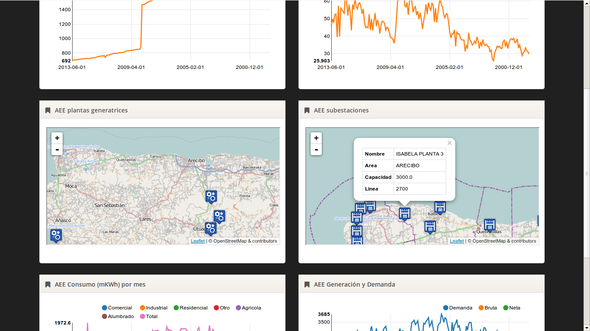

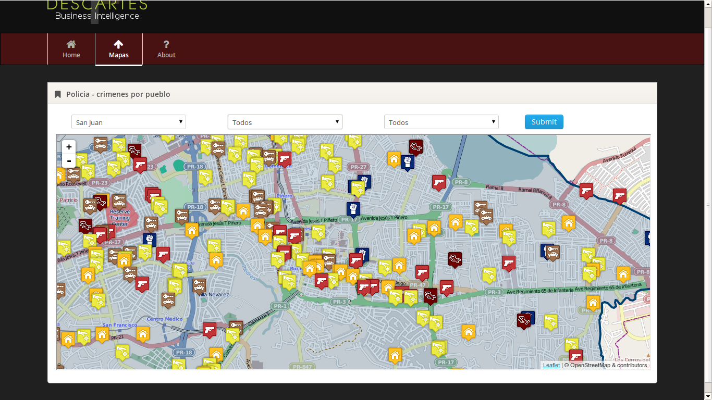


.. centered:: Integration was a design goal from day 0, as such LIBRE's output is meant to be easily captured for integration into other software, such a business intelligence software. This design philosophy allows developers to add many of LIBRE features to their software without writting a single line of code.

